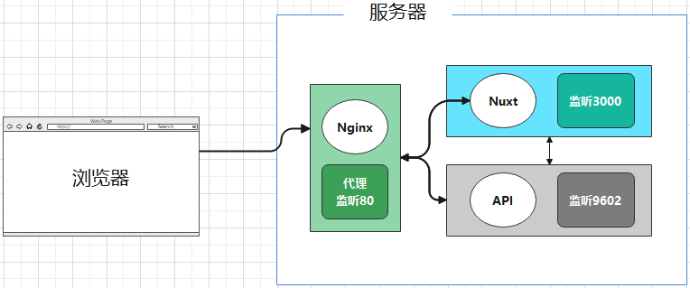

# 线上视频课程学习系统
线上视频课程学习系统，前端页面。


## 工程介绍

* 基于 Nxut 实现的“线上视频学习网站”前端工程
* **详细使用请见** [**操作手册**](https://github.com/enqiangjing/study-online-web/blob/main/options.md)

```shell
主仓库（项目信息汇总）
https://github.com/enqiangjing/study-online
```




## 项目使用

```shell
git clone git@github.com:enqiangjing/study-online-api.git
npm install
npm install --global pm2 # 线上环境安装pm2管理前端应用
npm run dev # 本地开发环境启动
```


## 版本信息

### 最新版本

>* 预览版 v0.0.1 --- 2022-05-28
>  + 完成前后端交互优化调整
>  + 增加选课页面及交互

### 版本历史

>* 预览版 v0.0.1 --- 2021-06-07
>  + 移除 session + redis 实现的登录状态保持
>  + 添加 token 用于登录状态保持，token 时效为 2H
>  + toke

>* **预览版 v0.0.1** --- 2021-05-21
>  + 完成各个页面随窗口自适应改造
>  + 文章编辑器更换为 wangEditor
>  + 部分页面样式调整

>* **预览版 v0.0.1** --- 2021-05-20
>  + 引入TypeScript，并使用TS重写部分页面
>  + 后台服务，统一改成由“api/”开头的调用
>  + 页面随窗口自适应优化

>* **预览版 v0.0.1** --- 2021-03-24
>  + 初始功能


## * 免责声明
* 本项目所有内容仅供参考和学习交流使用。
* 项目所存在的风险将由使用者自行承担，因使用本项目而产生的一切后果也由使用者自己承担。
* 凡以任何方式直接、间接使用本项目的人员，视为自愿接受本项目声明和法律法规的约束。